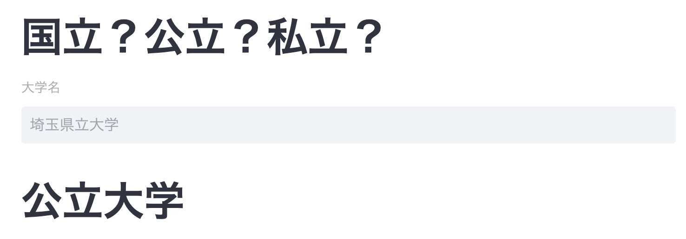

# PrivateOrPublic??
大学名と国立、私立、公立の分類を学習し、大学名から分類を行う機械学習Appです。
存在しない大学名に対しても推論を行えるので、自分で考えた大学名が機械にどのように認識されるのか楽しんでください。
（Ex. 国立大学は都市名がそのまま入ることが多い・・・？、私立大学には横文字が多そう・・・？）
```
pip install -r requirements.txt
```
## Pretrained Model
Download [model.pt](https://drive.google.com/file/d/1bYcHzZ5vcRScXBsGkYJkbhhdMgigfp9k/view?usp=sharing)
## Train
```
python train.py
```
## Run
```
streamlit run app.py
```

### Details
Web app Frameworkとして[Streamlit](https://streamlit.io/)を用いています。

事前学習済みBERT([東北大](https://huggingface.co/cl-tohoku/bert-base-japanese-whole-word-masking))を分類モデルにファインチューニングしています。
